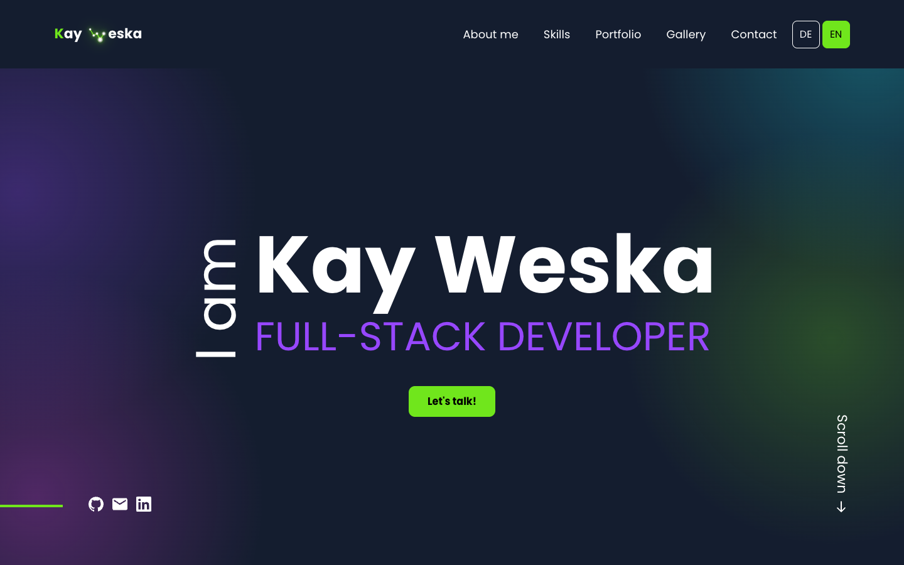
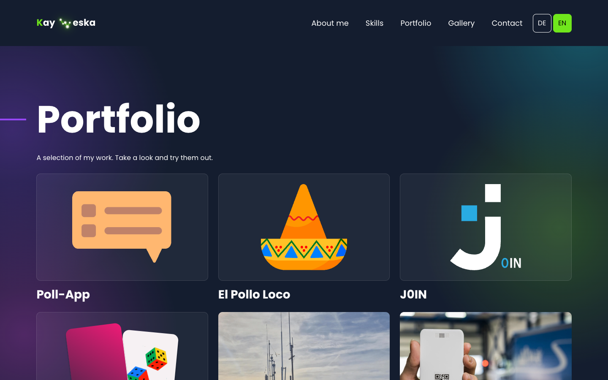
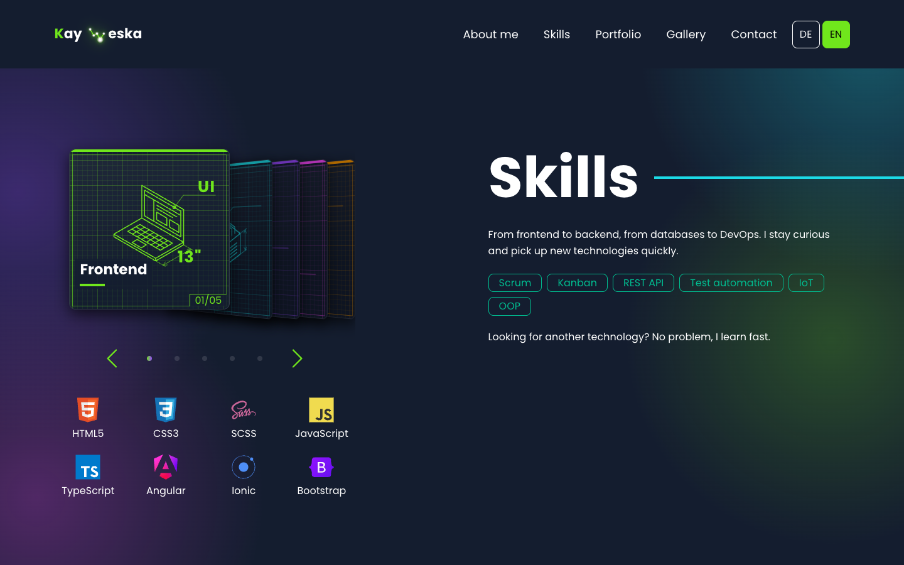

# Portfolio


The personal site of Kay Weska, full-stack and IoT developer. Projects, skills, gallery and contact, in German and English.

**Live: [weskakay.de](https://weskakay.de)**

## 💡 What is this?

A single page Angular application that presents my work: a portfolio grid where every project opens a detail view you can flip through, a skills section sorted into cards you flip through, a photo gallery and a contact form that actually sends mail. Two legal pages sit on their own routes, everything else lives on one scrolling page.

The whole site is bilingual. Rather than pulling in an i18n framework and a build per language, the copy lives in one typed dictionary in `data/i18n.ts` and a signal in `LanguageService` decides which half is rendered. Switching languages is instant, needs no reload and no second bundle, and the type system refuses a translation that only exists in one language.

A few pieces do the visual work. An intro loader covers the first paint while fonts and images settle. The portrait in the about section reacts to the pointer through a small Three.js shader. The skills stand side by side like sheets in a rack, one technical drawing per area, and flipping through them shows the tools of that area. Every animation steps aside under `prefers-reduced-motion`.

The contact form posts to a PHP script on the same host instead of a third party form service, so no visitor data leaves the server the site already runs on.

## 📸 Screenshots







## 🧠 Features

✅ German and English from one typed dictionary, switched by a signal, no reload
✅ Portfolio grid with a detail view per project: image slider, links to the live demo and the code, and a bar to flip on to the next project without closing
✅ Every web project runs on its own subdomain and is linked from its card
✅ Skills sorted into five blueprint cards that flip with arrows, dots, keys, a drag or a swipe
✅ Photo gallery moved by arrows, dots or a swipe
✅ One arrow and one button style shared by the whole site, with the same state on hover and on keyboard focus
✅ Accent rules run to the screen edge on every width, and very wide screens show the layout scaled up
✅ Intro loader covering the first paint
✅ Pointer reactive hero portrait built on Three.js
✅ Contact form posting to a PHP mailer on the same origin
✅ Imprint and privacy pages on their own routes
✅ Rotate hint for phones held in landscape
✅ Every animation respects `prefers-reduced-motion`
✅ Self hosted fonts and icons, no request to any CDN
✅ Meta, Open Graph and Twitter tags, plus `robots.txt` and `sitemap.xml`

## 🖥️ Tech Stack

| Layer | Technology |
|---|---|
| Framework | Angular 22, standalone components |
| Language | TypeScript 6, strict mode |
| State | Angular Signals |
| Styling | SCSS with global design tokens in `styles/_tokens.scss` |
| Animation | GSAP for the intro and the portrait, CSS for everything else |
| 3D | Three.js for the portrait shader |
| Forms | Reactive Forms with the app's own validation |
| Contact | PHP mailer on the same host |
| Hosting | netcup webhosting, Let's Encrypt |

## 🚀 Setup

```bash
git clone https://github.com/weskakay/portfolio.git
cd portfolio
npm install
ng serve                        # Dev server → http://localhost:4200
ng build --configuration=production
ng lint                         # Must exit 0
```

Copy `src/environments/environment.example.ts` to `environment.ts` and set `contactEndpoint` to the URL of your own mail script.

## 🧹 Code quality

The conventions are enforced by the linter rather than by review, so a violation fails the build instead of slipping through:

| Rule | Setting |
|---|---|
| Function length | `max-lines-per-function: 14` |
| Console output | `no-console`, only `error` and `warn` allowed |
| Types | strict mode, no implicit `any` |

`ng lint` is the gate before every build.

## 📁 Project Structure

```
portfolio/
├── src/
│   ├── app/
│   │   ├── components/
│   │   │   ├── hero/            # Headline plus the Three.js portrait
│   │   │   ├── about/
│   │   │   ├── skills/          # Skill areas as blueprint cards
│   │   │   ├── record-row/      # The rack the skill cards flip through
│   │   │   ├── portfolio/       # Project grid, detail modal, image slider
│   │   │   ├── gallery/         # Photo row with arrows and dots
│   │   │   ├── contact/
│   │   │   ├── navbar/ footer/
│   │   │   ├── intro-loader/
│   │   │   ├── rotate-hint/
│   │   │   └── impressum/ datenschutz/
│   │   ├── data/
│   │   │   ├── projects.ts      # Every project, both languages
│   │   │   ├── gallery.ts
│   │   │   └── i18n.ts          # Typed dictionary, DE and EN
│   │   └── services/
│   │       └── language.service.ts
│   ├── environments/
│   ├── styles/_tokens.scss      # Design tokens
│   └── styles.scss              # Base styles, shared arrow and button
├── public/
│   ├── contact_form_mail.php    # Mailer, ships with the build
│   ├── tech-icons/              # Skill icons
│   ├── images/
│   ├── fonts/
│   ├── robots.txt
│   └── sitemap.xml
└── screenshots/
```

## 🎨 Design

Dark base, a green and a violet accent, generous type. Colors, spacings, radii and fonts are defined once as CSS Custom Properties in `styles/_tokens.scss` and used as `var(--token)` everywhere else, so no component stylesheet carries a hex value.

Fonts and icons are self hosted, so the page makes no request to a CDN and renders the same whether or not an external host is reachable.

## 📄 License

Private project, published for reference.
